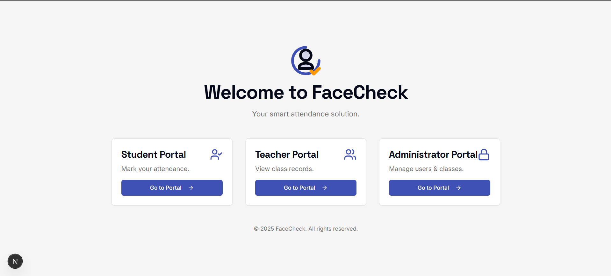

# FaceCheck Attendance

FaceCheck is a smart, modern attendance system that leverages a two-step facial verification process to ensure accurate and secure record-keeping. Built with a powerful stack including Next.js, Firebase, and Google's Gemini AI, this application provides distinct portals for administrators, teachers, and students, each with tailored functionalities.


*<p align="center"></p>*

---

## ✨ Core Features

The application is divided into three main user roles, each with a dedicated portal:

### 👨‍💻 Administrator Portal
- **User Management:** Securely register new students and teachers. The system captures a facial "faceprint" during registration to be used for verification.
- **Class Creation:** Easily create new classes with unique IDs and names.
- **Roster Management:** Assign registered teachers and enroll students into classes through an intuitive interface.
- **System Dashboard:** Get a quick overview of system statistics, including the total number of users, classes, teachers, and students.
- **User Deletion:** Securely remove users from the system, which also automatically un-enrolls them from all classes.

### 👩‍🏫 Teacher Portal
- **Class Dashboard:** View all assigned classes in a centralized dashboard.
- **Attendance Viewing:** Select a class and a date to view detailed attendance records.
- **Visual Reports:** See at a glance who was present or absent on a specific day.
- **Attendance Trends:** Analyze attendance over time with an interactive chart that shows present vs. absent trends for each class.

### 🎓 Student Portal
- **Secure Login:** Access the portal using the credentials generated by an administrator.
- **Two-Step Verification:**
  1. The student initiates the process by selecting their class and scanning their own face.
  2. To finalize the attendance, a registered teacher for that class must scan their face for authorization.
- **Real-time Feedback:** The system provides instant feedback on the success or failure of the verification process.

---

## 🚀 Tech Stack

- **Framework:** [Next.js](https://nextjs.org/) (App Router)
- **Styling:** [Tailwind CSS](https://tailwindcss.com/) with [ShadCN UI](https://ui.shadcn.com/) for components.
- **Database:** [Cloud Firestore](https://firebase.google.com/docs/firestore) for storing all user, class, and attendance data.
- **AI & Facial Verification:** [Google AI (Gemini)](https://ai.google.dev/) via [Genkit](https://firebase.google.com/docs/genkit) for facial comparison and verification.
- **Deployment:** Configured for [Firebase App Hosting](https://firebase.google.com/docs/app-hosting) (with workflows for Vercel/Netlify).

---

## 🛠️ Getting Started

Follow these instructions to get a copy of the project up and running on your local machine for development and testing purposes.

### Prerequisites

- [Node.js](https://nodejs.org/en) (v20 or later)
- `npm` or a compatible package manager
- A Firebase project with Firestore enabled.

### 1. Clone the Repository

```bash
git clone (https://github.com/Rayan-Ghosh/FaceCheck)>
cd FaceCheck
```

### 2. Install Dependencies

```bash
npm install
```

### 3. Set Up Environment Variables

This project requires several environment variables to connect to Firebase and Google AI services.

Create a file named `.env` in the root of your project and add the following variables. You can get your Firebase configuration from your project settings in the Firebase console.

```env
# Your secret key for Google AI Studio / Vertex AI
GEMINI_API_KEY=your_gemini_api_key_here

# Firebase public configuration
NEXT_PUBLIC_FIREBASE_API_KEY=your_firebase_api_key
NEXT_PUBLIC_FIREBASE_AUTH_DOMAIN=your_firebase_auth_domain
NEXT_PUBLIC_FIREBASE_PROJECT_ID=your_firebase_project_id
NEXT_PUBLIC_FIREBASE_STORAGE_BUCKET=your_firebase_storage_bucket
NEXT_PUBLIC_FIREBASE_MESSAGING_SENDER_ID=your_firebase_messaging_sender_id
NEXT_PUBLIC_FIREBASE_APP_ID=your_firebase_app_id
```

**Important:** The `.env` file is listed in `.gitignore` and should **never** be committed to your repository.

### 4. Run the Development Server

Once the dependencies are installed and the environment variables are set, you can start the development server.

```bash
npm run dev
```

---

## 🚀 Deployment

This project is set up for automated deployments using GitHub Actions.

### Firebase App Hosting (Recommended)

The included `.github/workflows/deploy.yml` file will automatically deploy the application to Firebase App Hosting when you push changes to the `main` branch.

**Setup Required:**
1. In your GitHub repository, go to `Settings > Secrets and variables > Actions`.
2. Create a secret named `FIREBASE_SERVICE_ACCOUNT_FACECHECK_ATTENDANCE_F71BK` with the JSON content of your Firebase service account key.
3. Create a secret named `GEMINI_API_KEY` with your Google AI API key.

### Vercel

**Setup Required:**
1. Import your GitHub repository into your Vercel/Netlify project.
2. The build command is `npm run build` and the output directory is `.next`.
3. **Crucially**, you must add all the environment variables from your `.env` file to the environment variable settings in your Vercel project dashboard.
